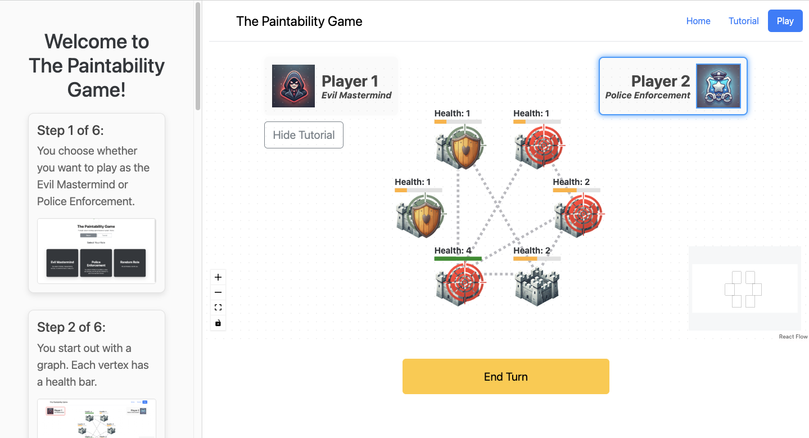
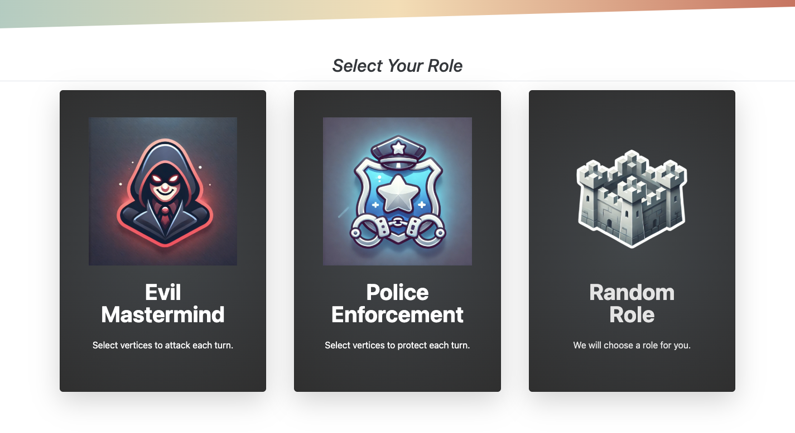
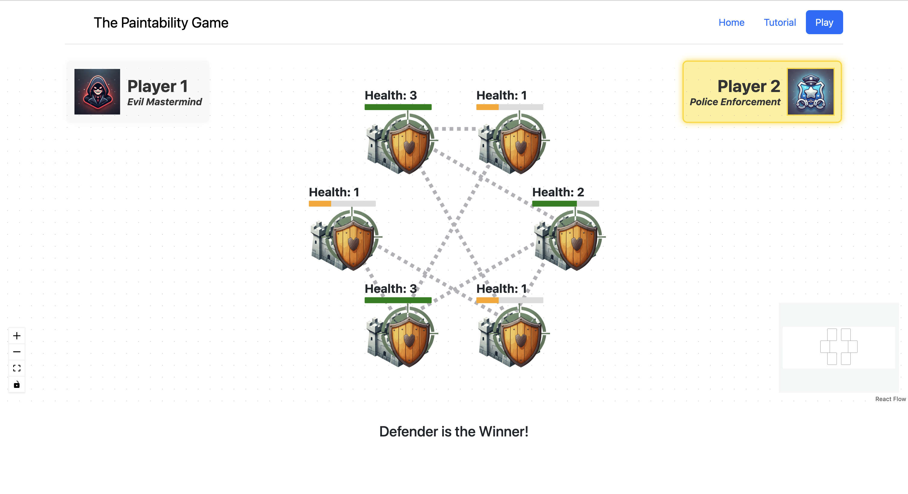

# The Paintability Game

[](https://the-paintability-game.netlify.app)

A strategy game where 2 players compete against each other by interacting with a dynamically updating graph.



**Contributors:**  
[Annie Zeng](https://github.com/wolfywolf7890): Developed core game algorithms, game state management, and random graph generator.  
[Ethan Zhang](https://github.com/ethanhanzhang): Provided testing and validation for game algorithms.  
[Roy Zhao](https://github.com/JiaqiZhao2004): Developed core react frontend and dynamic visualizations.  

## Overview

The **Paintability Game** is a strategic, turn-based two-player game played on a graph, where the players take on the roles of “Good” (Law Enforcement) and “Evil” (Mastermind). The game revolves around preventing or enabling criminal activities at the vertices of the graph.

- **Evil Mastermind:** Chooses vertices (represented by fortresses) to attack on every turn.
- **Police Enforcement:** Selects vertices to defend every turn, with the restriction that no two connected vertices can be protected together in the same turn.

**Evil Mastermind** wins if any vertex's health reaches zero, while **Law Enforcement** wins if all vertices are defended.

This game ties significantly to graph theory concepts such as list coloring and chromatic numbers. It offers an interactive and engaging way for players to explore these concepts while learning about graph properties.

## How To Play
This tutorial is **also provided on the game page** to familiarize you with the rules and see how the game connects to graph properties like chromatic numbers and list coloring.

### Step 1 of 6:
#### Choose whether you want to play as the Evil Mastermind or Police Enforcement.


### Step 2 of 6:
#### You start out with a graph. Each vertex has a health bar.


### Step 3 of 6:
#### At the start of each turn, the Evil Mastermind chooses vertices to attack however they desire.


### Step 4 of 6:
#### The defender responds by protecting the attacked vertices. However, if two vertices share an edge, the defender can only protect one of them.


### Step 5 of 6:
#### Any unprotected vertex at the end of the turn loses 1 health. Any successfully protected vertex cannot be attacked again.


### Step 6 of 6:
#### The attacker wins if any vertex has been reduced to zero health. The defender wins if all vertices are safe.



## Features

- **Interactive Gameplay:** Players click on graph vertices to make moves.
- **Graph Selection:** Custom or randomly generated graphs.
- **Tutorial & Instruction:** Learn game mechanics and graph theory concepts as they relate to list coloring and chromatic numbers.

## Architecture


### Backend:

- **Technology:** TypeScript 
- **Functionality:**
  - Store game state, advance turns, and determine winners.
  - Generate and manage random graphs.

### Frontend:

- **Technology:** React, TypeScript
- **Functionality:**
  - Visualize the game graph and update the game state based on user interactions.
  - Accept user input to render nodes accordingly (e.g., targeted, defended).
  - Provide real-time feedback and updates during gameplay.


## Deploying the App with Docker

Follow these steps to deploy the app on your machine using Docker:

### Prerequisites

- Make sure you have Docker installed on your machine. You can download it from [Docker's official website](https://www.docker.com/).

---

### 1. Clone the Repository

```bash
git clone https://github.com/JiaqiZhao2004/The-Paintability-Game
cd frontend-react
```

---

### 2. Build the Docker Image

Run the following command to build the Docker image:

```bash
docker build -t paintability-game .
```

---

### 3. Run the Docker Container

Run the app in a Docker container by exposing the appropriate port (e.g., `5173`):

```bash
docker run -p 5173:5173 paintability-game
```

---

### 4. Access the App

Open your browser and navigate to:

```
http://localhost:5173
```

You should see the app running!


### Notes

- If you want to run the app with a custom port, replace `-p 5173:5173` with your desired port mapping (e.g., `-p 8080:5173`).